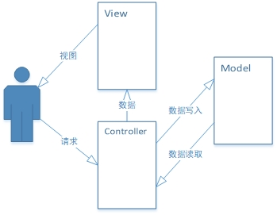
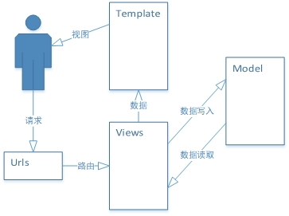

[TOC]

# Django Base Part2

## MVC设计模式

​	MVC全名是Model View Controller，是模型（model）-视图（view）-控制器（controller）的缩写，一种软件设计典范，用一种业务逻辑、数据、界面显示分离的方法组织代码，将业务逻辑聚集到一个部件里面，在改进和个性化定制界面及用户交互的同时，不需要重新编写业务逻辑。MVC被独特的发展起来用于映射传统的输入、处理和输出功能在一个逻辑的图形化用户界面的结构中。而Django是采用MVC模式的MTV框架。

- Model（模型）表示应用程序核心（比如数据库记录列表）。
- View（视图）显示数据（数据库记录）。
- Controller（控制器）处理输入（写入数据库记录）。

**Model（模型）** 是应用程序中用于处理应用程序数据逻辑的部分。通常模型对象负责在数据库中存取数据。

**View（视图）** 是应用程序中处理数据显示的部分。通常视图是依据模型数据创建的。

**Controller（控制器）** 是应用程序中处理用户交互的部分。通常控制器负责从视图读取数据，控制用户输入，并向模型发送数据。

​	Django的MTV模式本质上与MVC模式没有什么差别，也是各组件指尖为了保持松耦合关系，只是定义上有些许不同，Django的MTV分别代表：

- Model（模型）负责业务对象与数据库的对象（ORM）
- Template（模版）负责如何把页面展示给用户
- View（视图 ）负责业务逻辑，并在适当的时候调用Model和Template

## Model的创建

在这里模拟一个简单的项目场景来建立一张E-R实体联系图。学生选课系统

**student**表， 字段有id，s_name，s_sex，s_birth， g_id外键关联班级表

**grade**表， 字段有id，g_name, 

**course**表， 字段有Id，c_name, 