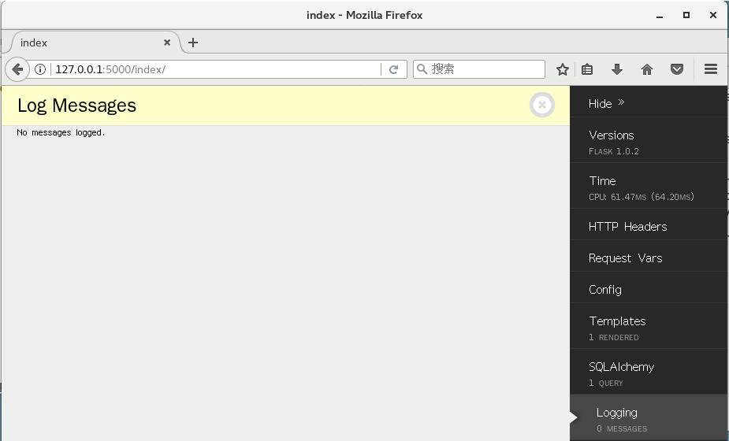

# Flask DebugToolbar 的使用

## 安装

```bash
pip install flask-debugtoolbar
```

## 配置

| Name                               | Description                         | Default                    |
| ---------------------------------- | ----------------------------------- | -------------------------- |
| `DEBUG_TB_ENABLED`                 | 启用工具栏。默认与app.debug值相同   | `app.debug`                |
| `DEBUG_TB_HOSTS`                   | 允许Debug的白名单主机列表           | any host                   |
| `DEBUG_TB_INTERCEPT_REDIRECTS`     | 是否拦截重定向。                    | `True`                     |
| `DEBUG_TB_PANELS`                  | 面板中的模块/类名称列表                      | enable all built-in panels |
| `DEBUG_TB_PROFILER_ENABLED`        | 在所有请求上启用分析器 | `False`, 用户启用     |
| `DEBUG_TB_TEMPLATE_EDITOR_ENABLED` | 启用模板编辑器          | `False`                    |

## 使用

我接着上一篇蓝图中的代码进行编写

`App/__init__.py`

```python
from flask import Flask
from flask_sqlalchemy import SQLAlchemy
from flask_debugtoolbar import DebugToolbarExtension

from config import SQLALCHEMY_DATABASE_URI, SQLALCHEMY_TRACK_MODIFICATIONS, SECRET_KEY

db = SQLAlchemy()

toolbar = DebugToolbarExtension()

def create_app():
    app = Flask(__name__)
    app.debug = True
    app.config['SQLALCHEMY_DATABASE_URI'] = SQLALCHEMY_DATABASE_URI
    app.config['SQLALCHEMY_TRACK_MODIFICATIONS'] = SQLALCHEMY_TRACK_MODIFICATIONS
    app.config['SECRET_KEY'] = 'TTC'
    
    db.init_app(app=app)
    toolbar.init_app(app)
    return app
    
```

写一个ORM的对象

`models.py`
```python
from App import db

class Student(db.Model):
    s_id = db.Column(db.Integer, primary_key=True, autoincrement=True)
    s_name = db.Column(db.String(20))

    __tablename__ = 'student'

    def __init__(self, s_name):
        self.s_name = s_name
 
    def __repr__(self):
        return '<Student %r, %r>' % (self.s_id, self.s_name)

```

修改一下views控制文件

`views.py`

```python
from flask import render_template

from App.Index import index
from App.Index.models import *

@index.route('/')
def index():
    stus = Student.query.all()
    return render_template('index.html', stus=stus)
```
在模板文件中添加数据解析

`index.html`

```python
<html>
	<head>
    	<title>Index</title>
    </head>
    <body>
    	<h1></h1>
        
        	<p>{{ stu }}</p>
        
    </body>
</html>
```
这时我们的数据库中还没有建表。通过交互式环境来建表
```bash
(venv) [tianjun@192 Flask_TTC]$ python manager.py shell
>>> from App.Index.models import *
>>> db.create_all()  # 创建表
>>> stu = Student('TTC')  # 创建模型对象
>>> db.session.add(stu)  # 通过事务添加对象
>>> db.session.commit()  # 将事务提交
```

运行服务器
```bash
(venv) [tianjun@192 Flask_TTC]$ python manager.py runserver
 * Serving Flask app "App" (lazy loading)
 * Environment: production
   WARNING: Do not use the development server in a production environment.
   Use a production WSGI server instead.
 * Debug mode: on
 * Running on http://127.0.0.1:5000/ (Press CTRL+C to quit)
 * Restarting with stat
 * Debugger is active!
 * Debugger PIN: 244-604-680
```


## 内置面板

### Versions

显示已安装的Flask版本，展开视图会显示setuptools检测到的所有已安装软件包及其版本


### Time

显示处理当前请求所用的时间。视图中包括了CPU时间的细分，用户和系统。


### HTTP Headers

显示当前请求的HTTP头信息。


### Request Vars

显示Flask请求相关变量的详细信息，包括视图函数参数，Cookie，会话变量以及GET和POST变量。 


### Config

显示Flask应用程序的配置字典`app.config`


### Templates

显示有关为此请求呈现的模板的信息以及提供的模板参数的值。 


### SQLAlchemy

显示当前请求期间运行的SQL查询。 


### Logging

显示当前请求期间记录的日志消息。 



### Route List

显示Flask URL路由规则。 


### Profiler

报告当前请求的分析数据。由于性能开销，分析在默认情况下是禁用的。单击复选标记以打开或关闭分析。启用分析器后，刷新页面以通过分析重新运行。 


