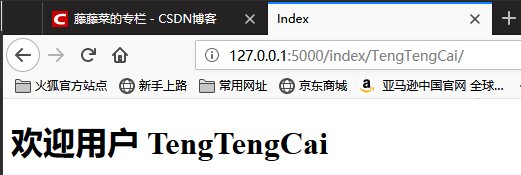

[TOC]

# Flask基础Part2

Flask是一个Python实现的Web开发微框架。他与Django不同，Django是大而全面，而Flask是短小精悍。Django就好比买电脑时的一台整机，而Flask更像是一个可以自己DIY的组装机，可以跟具自己项目的需求对框架进行附加额外的模块。

## 路由

在Flask中的路由非常的简单，只需要把一个函数绑定到`route()`装饰器上，并将URL传递进去。

```python
@app.route('/')
def index():
	return 'Index Page'

@app.route('/hello')
def hello():
    return 'Hello world'
```

### 路由中的变量规则

有时候需要接收URL中的参数变量，可以把参数标记为一个变量`<变量名>`，这个部分将会作为命名参数传递给函数。同时还可以限制参数变量的类型`<类型:变量名>`。

```python
@app.route('/user/<username>/')
def show_user_info(username):
    # 进行数据查询的代码
    return 'User %s' % username

@app.route('/post/<int:aritle_id>/')
def show_article(aritle_id):
    # 进行数据查询的代码
    return 'Aritle ID : %s' % aritle_id
```

数据类型一共有三种：int, float, path

|  类型  | 描述                   |
| :---: | -------------------------- |
|  int  | 接受整数                   |
| float | 同 int ，但是接受浮点数    |
| path  | 和默认的相似，但也接受斜线 |

> **注意**
>
> 路由一定要写规范，不规范的URL路由会导致额外的404错误。
>
> 例如：
>
> ```python
> @app.route('/projects/')
> def projects():
>     return 'The project page'
> 
> @app.route('/about')
> def about():
>     return 'The about page'
> ```
>
> 当访问projects时，使用规范的URL地址`http://127.0.0.1/projects/`能够正常的访问，而使用`http://127.0.0.1/projects`时Flask会自动的重定向到规范的URL地址。
>
> 当访问about时，使用不规范的URL地址`http://127.0.0.1/about`能正常访问，但是当使用规范的URL地址`http://127.0.0.1/about/`进行访问时就会报404错误。

### 生成URL

既然Flask能匹配URL自然也能够生成对应的URL。这需要使用到`url_for()`方法。

```python
from Flask import Falsk, url_for
app = Flask(__name__)

@app.route('/')
def index():
    print(url_for('index'))
    print(url_for('do_login', name='TengTengCai'))
    print(url_for('get_user', user_id='1234'))
    print(url_for('get_grade', grade_id='0987'))
    return 'Index Page'

@app.route('/login/')
def do_login():
    return 'Login Method'

@app.route('/user/<user_id>/')
def get_user(user_id):
    return 'User ID is %s' % str(user_id)

@app.route('/grade/<int:grade_id>/')
def get_grade(grade_id):
    return 'Grade ID is %s type is %s' % (str(grade_id), type(grade_id))
```

通过`python app.py `启动服务器，通过访问根路径查看输出结果。

```bash
/
/login/?name=TengTengCai
/user/1234/
/grade/0987/
```

## 模版渲染

Flask和Django一样都配备了Jinja2模版引擎，可以使用`render_template()`方法来渲染模版。

目录结构

```bash
│  app.py
├─static
└─templates
        index.html
```

app.py

```python
from flask import render_template, Flask, Manager

app = Flask(__name__)

manager = Manager(app)

@app.route('/index/')
@app.route('/index/<name>/')
def index(name=''):
    return render_template('index.html',name=name )

if __name__ == '__main__':
    manager.run()
```

index.html模版文件, 使用jinja2模版渲染，将名字显示在模版html文件中，加载静态文件。

> 模版文件（templates）和静态文件（statics）的目录访问，默认于app.py属于同级目录，如果目录地址发生改变，需要进行设置。（设置路径会在后面的蓝图（blueprints）讲到）

```html
<!DOCTYPE html>
<html lang="en">
<head>
    <meta charset="UTF-8">
    <title>Index</title>
    <link type="text/css" rel="stylesheet" href="/static/css/style.css">
</head>
<body>
    <h1>欢迎用户 {{ name }}</h1>
</body>
</html>
```

style.css文件

```css
* {
    margin: 0;
    padding: 0;
}
h1 {
    color: lightgreen;
}
```

启动服务，访问`http://127.0.0.1:5000/index/TengTengCai/`




## 请求（request）

request请求，在使用请求之前需要从Flask中导入它。

```python
from flask import request
```

当前请求的HTTP方法可以通过method属性来获取。

GET方法中的参数可以通过`request.args.get(key, default)`来获取

POST方法中的参数可以通过`request.form.get(key, default)`来获取

如果请求中存在文件则可以通过files属性来获取Python中的file对象

```python
@app.route('/UserInfo/', methods=['POST', 'GET'])
def get_user():
    if request.method == 'GET':
        args = request.args
        name = args.get('name', '')  # 如果name参数只有一个可使用get
        names = args.getlist('name')  # 如果name参数有多个可使用getlist，返回一个list
    elif rqeuest.method == 'POST':
        name = request.form.get('name'）  # 如果name参数表单中只有一个可使用get
        names = request.form.getlist('name')  # 如果name参数表单中有多个可使用getlist,返回一个list
        my_files = request.files['my_file']
        my_files.save('filename')  # 存储的文件路径和名称
    else:
        return 'error'
    return 'Name is %s, Names is %s' % (name, str(names))
```

## 响应（response）

视图函数的返回值会被自动转换为一个响应对象。如果返回值是一个字符串，它会被转换为该字符串为主体的、状态码为`200 OK`的MIME类型是`test/html`的响应对象。

Flask把返回值转换为响应对象的过程：

1. 如果返回的是一个正确的响应对象，它会从视图直接返回。
2. 如果返回的是一个字符串，响应对象会用字符串数据和默认参数创建。
3. 如果返回的是一个元组，且元组中的元素可以提供额外的信息。这样的元组必须是`(response, status, headers)`的形式, 且至少包含一个元素。status值会覆盖状态代码，headers可以是一个列表或字典，作为额外的消息标头值。
4. 如果上述条件均不满足，Flask会假设返回值是一个不合法的WSGI应用程序，并转化为一个请求对象。（所以经常会看到关于WSGI的代码报错，实则是response响应出错了）

在视图中可以使用`make_response()`函数。使用前需要导入对应模块

```python
from flask import make_response
```

```python
@app.route(/myResponse/)
def get_response():
    resp = make_response(render_template('test.html'), 200)  # 生成一个新的response对象
    return resp  # 返回response对象
```

## 重定向和错误（redirect,error）

我们可以使用`redirect()`函数把用户重定向到其他地方。放弃请求并返回错误代码，用abort()函数。

```python
from flask import abort, redirect, url_for, render_template

@app.route('/')  # 主页的路由
def index():
    return redirect(url_for('login'))  # 重定向到login方法

@app.route('/login/')  # login的路由
def login():  
    abort(404)  # 抛出错误，终止运行
    return 'error'

@app.errorhandler(404)  # 获取到404错误
def page_not_found(error)：
    return render_template('page_not_found.html'), 404  # 返回404页面，状态码为404
```

默认情况下，错误代码会显示一个黑白的错误页面，如果要定制，则可以使用`errorhandler()`装饰器