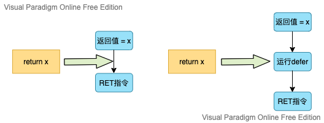

# Go语言008函数

Go语言中支持函数、匿名函数和闭包，并且函数在Go语言中是一等公民。

## 函数定义

Go语言中定义函数使用`func`关键字，具体格式如下：

```go
func 函数名(参数)(返回值) {
    函数体
}
```

其中：

- 函数名：由字母、数字、下划线组成。但函数名的第一个字母不能是数字。在同一个包内，函数名也称不能重名。
- 参数：参数由参数变量和参数变量的类型组成，多个参数之间使用`,`分割。
- 返回值：返回值由返回值变量和其变量类型组成，也可以只写返回值的类型，多个返回值必须用`()`包裹，并用`,`分割。
- 函数体：实现指定功能的代码

如：

```go
package main

import "fmt"

func initSum(x int, y int) int {
    return x + y
}

func main() {
    z := initSum(1, 2)
    fmt.Printf("z: %v\n", z)
}
```

## 函数的调用

定义了函数之后，我们可以通过`函数名()`的方式调用函数。例如我们调用上面定义的两个函数，如：

```go
package main

import "fmt"

func initSum(x int, y int) int {
    return x + y
}

func main() {
    z := initSum(1, 2)
    fmt.Printf("z: %v\n", z)
}
```

## 参数

### 类型简写

函数的参数中如果相邻变量的类型相同，则可以省略类型，如

```go
func initSum(x, y int) int {
    return x + y
}
```

上面的代码中，`sum`函数有两个参数，这两个参数的类型均为`int`，因此可以省略`x`的类型，因为`y`后面有类型说明，`x`参数也是该类型。

### 可变参数

可变擦是是值函数的参数数量不固定。Go语言中的可变参数通过在参数名后面加`...`来标识。

注意可变参数通常要作为函数的最后一个参数。

```go
func initSum(x ...int) int {
    fmt.Println(x)
    sum := 0
    for _, v := range x {
        sum = sum + x
    }
    return sum
}
```

调用上面的函数：

```go
package main

import "fmt"

func initSum(x ...int) int {
    fmt.Println(x)
    sum := 0
    for _, v := range x {
        sum = sum + v
    }
    return sum
}

func main() {
    v1 := initSum()
    v2 := initSum(11)
    v3 := initSum(11, 22)
    v4 := initSum(11, 22, 33)
    fmt.Println(v1, v2, v3, v4)
}
```

输出：

```go
[]
[11]
[11 22]
[11 22 33]
0 11 33 66
```

固定参数搭配可变参数使用时，可变参数要放在古代参数的后面，如：

```go
package main

import "fmt"

func initSum(x int, y ...int) int {
    fmt.Println(x, y)
    sum := x
    for _, v := range y {
        sum += v
    }
    return sum
}
func main() {
    v1 := initSum(111)
    v2 := initSum(111, 222)
    v3 := initSum(111, 222, 333)
    v4 := initSum(111, 222, 333, 444)
    fmt.Println(v1, v2, v3, v4)
}
```

输出：

```
111 []
111 [222]
111 [222 333]
111 [222 333 444]
111 333 666 1110
```

本质上，函数的可变参数是通过切片来实现的。

## 返回值

Go语言中通过`return`关键字向外输出返回值。

### 多返回值

Go语言中函数支持多返回值，函数如果有多个返回值时必须用`()`将所有返回值包裹起来。

```go
package main

import  "fmt"


func calc(x, y int) (int, int) {
    sum := x + y
    sub := x - y
    return sum, sub
}

func main() {
    a, b := calc(10, 11)
    fmt.Println(a, b)
}
```

输出：

```
21 -1
```

当返回类型为slice时，nil可以看做是一个有效的slice，没必要显示返回一个长度为0的切片。

## 函数进阶

### 变量作用域

#### 全局变量

全局变量是定义在函数外部的变量，它在程序整个运行周期内都有效。在函数中可以访问到全局变量。

```go
package main

import "fmt"

var num int64 = 10

func testGlobalVar() {
    fmt.Printf("num=%d\n", num)  // 函数中可以访问全局变量num
}

func main() {
    testGlobalVar()
}
```

输出：

```
num=10
```

#### 局部变量

局部变量又分为两种：函数内定义的变量无法在该函数外使用。

```go
package main

import "fmt"

func testLocalVar() {
    x := 100
    fmt.Printf("x=%d\n", x)
}

func main() {
    testLocalVar()
    fmt.Println(x)
}
```

如果局部变量和全局变量重名，优先访问局部变量。

```go
package main

import "fmt"

var num int = 10

func testNum() {
    num := 100
    fmt.Printf("num=%d\n", num)
}

func main() {
    testNum()
}
```

输出：

```
num=100
```

语法块定义的变量，通常会在if条件判断、for循环、switch语句上使用这种定义变量的方式。

```go
package main 

import "fmt"

func testLocalVar(x, y int) {
    fmt.Println(x, y)
    if x > 0 {
        z := 100
        fmt.Println(z)
    }
    //fmt.Println(z)  //此处无法使用变量z
}

func main() {
    testLocalVar(1, 2)
}
```

输出：

```
1 2
100
```

for循环语句中定义的变量，也是只在for语句块中生效：

```go
package main

import "fmt"

func testLocalVar() {
    for i:= 0; i < 10; i++ {
        fmt.Println(i)
    }
    //fmt.Println(i)  // 此处无法使用变量i
}

func main() {
    testLocalVar()   
}
```

### 函数类型与变量

#### 定义函数类型

我们可以使用`type`关键字来定义一个函数类型，具体格式如下：

```go
type calculation func(int, int) int
```

上面语句定义了一个`calculation`类型，它是一种函数类型，这种函数接收两个int类型的参数并且返回一个int类型的返回值。

简单来说，凡是满足这个条件的函数都是calculation类型的函数，例如下面的add和sub是calculation类型。

```go
package main

import "fmt"

type calculation func(int, int) int

func add(x, y int) int {
    return x + y
}

func sub(x, y int) int {
    return x - y
}

func main() {
	var c calculation
    
    c = add
    a := c(1,2)
    fmt.Println(a)
    
    c = sub
    b := c(1,2)
    fmt.Println(b)
}
```

输出：

```
3
-1
```

### 高阶函数

高阶函数分为函数作为参数和函数作为返回值两部分

#### 函数作为参数

```go
package main

import "fmt"

func add(x, y int) int {
    return x + y
}

func calc(x, y int, op func(int, int) int) int {
    return op(x, y)
}

func main() {
    a := calc(1, 2, add)
    fmt.Println(a)
}
```

输出：

```
3
```

#### 函数作为返回值

```go
package main

import (
	"errors"
	"fmt"
)

func add(x, y int) int {
	return x + y
}

func sub(x, y int) int {
	return x - y
}

func do1(s string) (func(int, int) int, error) {
	switch s {
	case "+":
		return add, nil
	case "-":
		return sub, nil
	default:
		err := errors.New("无法识别的操作符")
		return nil, err
	}
}

func main() {
	f, err := do1("+")
	if err != nil {
		fmt.Println(err)
		return
	}
	a := f(1, 2)
	fmt.Println(a)
}
```

输出：

```
3
```

### 匿名函数和闭包

#### 匿名函数

函数可以作为返回值，但是在Go语言中函数内部不能再像之前那样定义函数了，只能定义匿名函数。匿名函数就是没有函数名的函数，匿名函数的定义格式如：

```go
func(参数) () {
    函数体
}
```

匿名函数没有函数名，所以没办法像普通函数那样调用，所以匿名函数需要保存到某个变量或者作为立即执行函数：

```go
package main

import "fmt"

func main() {
    add := func(x, y int) {
        fmt.Println(x + y)
    }
    add(11, 22)
    func(x, y int) {
        fmt.Println(x - y)
    }(11, 22)
}
```

输出：

```
33
-11
```

匿名函数多用于实现回调函数和闭包。

#### 闭包

闭包指的是一个函数和与其相关的引用环境组合而成的实体。简单来说，`闭包=函数+引用环境`。 

```go
package main

import "fmt"

func adder() func(int) int {
  var x int
  return func(y int) int {
    x += y
    return x
  }
}

func main() {
  var f = adder(10)
  fmt.Println(f(10))
  fmt.Println(f(20))
  fmt.Println(f(30))
  
  f1 := adder(20)
  fmt.Println(f1(40))
  fmt.Println(f1(50))
}
```

输出：

```
10
30
60
40
90
```

变量`f`是一个函数并且它引用了外部作用域中的`x`变量，此时`f`就是一个闭包。在`f`的生命周期内，变量`x`也一直有效。如：

```go
package main

import "fmt"

func adder(x int) func(int) int {
    return func(y int) int {
        x += y
        return x
    }
}

func main() {
    var f = adder(10)
    fmt.Println(f(10))
    fmt.Println(f(20))
    fmt.Println(f(30))

    f1 := adder(20)
    fmt.Println(f1(40))
    fmt.Println(f1(50))
}

```

输出：

```
20
40
70
60
110
```

如：

```go
package main

import (
	"fmt"
	"strings"
)

func makeSuffixFunc(suffix string) func(string) string {
	return func(name string) string {
		if !strings.HasSuffix(name, suffix) {
			return name + suffix
		}
		return name
	}
}

func main() {
	jpgFunc := makeSuffixFunc(".jpg")
	txtFunc := makeSuffixFunc(".txt")
	fmt.Println(jpgFunc("test"))
	fmt.Println(jpgFunc("test.jpg"))
	fmt.Println(txtFunc("test"))
	fmt.Println(txtFunc("test.txt"))
}
```

输出：

```
test.jpg
test.jpg
test.txt
test.txt
```

如：

```go
package main

import "fmt"

func calc(base int) (func(int) int, func(int) int) {
    add := func(i int) int {
        base += i
        return base
    }
    sub := func(i int) int {
        base -= i
        return base
    }
    return add, sub
}

func main() {
    f1, f2 := calc(10)
    fmt.Println(f1(1), f2(2))
    fmt.Println(f1(3), f2(4))
    fmt.Println(f1(5), f2(6))
} 
```

输出：

```
11 9
12 8
13 7
```

闭包 = 函数 + 引用环境

## defer语句

Go语言中的`defer`语句会将其后面跟随的语句进行延迟处理。在`defer`	归属的函数即将返回时，将延迟处理的语句按`defer`	定义的逆序进行执行，也就是说，先被`defer`的语句最后被执行，最后被`defer`的语句，最先被执行。

如：

```go
package main

import "fmt"

func main() {
    fmt.Println("start")
    defer fmt.Println(1)
    defer fmt.Println(2)
    defer fmt.Println(3)
    fmt.Println("end")
}
```

输出：

```
start
end
3
2
1
```

由于`defer`语句延迟调用的特性，所以`defer`语句能非常方便的处理资源释放问题，比如：资源清理、文件关闭、解锁以及记录时间等。

### defer执行时机

在Go语言的函数中`return`语句在底层并不是原子操作，它分为给返回值赋值和RET指令两步。而`defer`语句执行的时机就在返回值赋值操作后，RET指令执行前。具体如图：



### defer案例1

阅读下面代码，写出最后的打印结果

```go
package main

import "fmt"

func f1() int {
    x := 5
    defer func() {
        x++
    }()
    return x
}

func f2() (x int) {
    defer func() {
        x++
    }()
    return 5
}

func f3() (y int) {
    x := 5
    defer func() {
        x++
    }()
    return x
}

func f4() (x int) {
    defer func(x int) {
        x++
    }(x)
    return 5
}

func main() {
    fmt.Println(f1())
    fmt.Println(f2())
    fmt.Println(f3())
    fmt.Println(f4())
}
```

输出：

```
5
6
5
5
```

### defer案例2

```go
package main

import "fmt"

func calc(index string, a, b int) int {
    ret := a + b
    fmt.Println(index, a, b, ret)
    return ret
}

func main() {
    x := 1
    y := 2
    defer calc("AA", x, calc("A", x, y))
    x = 10
    defer calc("BB", x, calc("B", x, y))
    y = 20
}
```

输出：

```
A 1 2 3
B 10 2 12
BB 10 12 22
AA 1 3 4
```

## panic/recover

Go语言中目前没有异常机制，但是使用`panic/recover`模式来处理错误。`panic`可以在任何地方引发，但`revover`只有在`defer`调用的函数中有效。

```go
package main

func fooA() {
    fmt.Println("foo A")
}

func fooB() {
    panic("panic in B")
}

func fooC() {
    fmt.Println("foo C")
}

func main() {
    fooA()
    fooB()
    fooC()
}
```

输出：

```go
foo A
panic: panic in B

goroutine 1 [running]:
main.fooB()
	.../GoProject/github.com/TengTengCai/case009/main.go:10 +0x27
main.main()
	.../GoProject/github.com/TengTengCai/case009/main.go:19 +0x1c

```

程序运行期间`fooB`中引发了`panic`导致程序崩溃，异常退出了。这个时候就可以通过`recover`将程序恢复回来，继续往后执行。

```go
package main

import "fmt"

func fooA() {
    fmt.Println("foo A")
}

func fooB() {
    defer func() {
        err := recover()
        if err != nil {
            fmt.Println("recover in B")
        }
    }()
    panic("panic in B")
}

func fooC() {
    fmt.Println("foo C")
}

func main() {
    fooA()
    fooB()
    fooC()
}
```

输出：

```
foo A
recover in B
foo C
```

> 注意：
>
> 1. `recover()`必须搭配`defer`使用
> 2. `defer`一定要在可能引发`panic`的语句之前定义。
