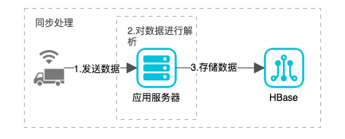
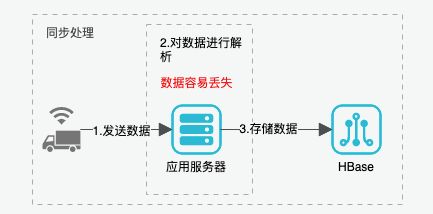
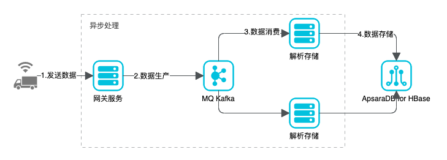

# Kafka概述

## 定义

kafka是一个**分布式**事务日志架构的基于**发布/订阅模式**的**消息队列**（Message Queue），主要应用于大数据实时处理领域。

## 消息队列

假如有一下场景

有成千上万的新能源车辆需要发送数据到企业平台，需要对数据进行解析和存储。

### 同步处理

如果未使用`Message Queue`数据流图如下：

1. 车辆直接发送数据给应用服务器
2. 应用服务器对数据进行解析
3. 对解析后的数据进行存储

以上的操作都是串行的，当数据量大时，就会导致应用服务器处理数据的速度跟不上，而导致数据的丢失。如图：

### 异步处理

如果使用`Kafka`消息队列，则对应用服务器可以进行解偶处理，可分成专门接收车辆数据的数据生产者，和消息队列后端的消息消费者。实现数据接收和解析的解偶。如图：

1. 车辆发送数据到网关服务，网关服务维持基本的连接。
2. 网关服务对收到的数据全部生产到kafka消息队列中。
3. 消息解析从kafka队列中消费数据，进行数据解析，可以多个解析程序对数据进行处理，动态调整。
4. 消息解析对数据进行hbase的数据存储。

## 为什么使用消息队列

- 解偶：允许你独立的扩展或修改两边的处理过程，只要他们遵守同样的接口约束。
- 可恢复性：系统的一部分失效时，不会影响到整个系统。消息队列降低了进程间的耦合程度，所以即使一个处理消息的进程挂掉了，也不影响系统的运行。
- 缓冲：有助于控制和优化数据流经过系统的速度，解决生产消息和消费消息速度不一致的情况。
- 灵活性 & 峰值处理能力：在访问量激增的情况下，应用仍然需要继续发挥作用，但是这样的突发流量并不常见。如果以能处理这类峰值访问为标准来投入资源随时待命无疑是巨大的浪费。使用消息队列能够使关键组件顶住突发的访问压力，而不会因为突发的超负荷的请求而完全奔溃。
- 异步通信：很多时候，用户不想也不需要立即处理消息。消息队列提供了异步处理机制，允许用户把一个消息放入队列，但并不立即处理它。想向队列中放入多少消息就放多少，然后再需要的时候再去处理它们。