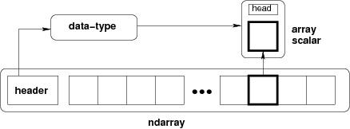

# NumPy Ndarray对象，数据类型和NumPy数组

NumPy是用Python进行科学计算的基础软件包。

它包含以下内容：        

- 一个强大的N维数组对象
- 复杂的（广播）功能
- 用于集成C / C ++和Fortran代码的工具
- 有用的线性代数，傅里叶变换和随机数能力    

除了明显的科学用途外，NumPy还可以用作通用数据的高效多维容器。可以定义任意数据类型。这使得NumPy能够与各种数据库无缝并快速地整合。 

## Ndarray对象

NumPy提供了一个N维数组类型，`ndarray`，它描述了相同类型‘元素’的集合。可以使用基于零的索引访问集合中的项目。

`ndarray`中的每个元素在内存中使用相同大小的块，`ndarray`中的每个元素是数据类型对象的对象（称为`dtype`）。

从`ndarray`对象提取的任何元素（通过切片）由一个数组标量类型的Python对象表示。下图显示了ndarray,数据类型对象（`dtype`）和数组标量类型之间的关系。



`ndarray`类的实例可以通过本教程后面描述的不同的数组创建例程来构造。基本的`ndarray`是使用NumPy中的数组函数来创建的。

下面创建一个`ndarray`：

```python
In [1]: import numpy as np

In [2]: np.array([1, 2, 3])
Out[2]: array([1, 2, 3])
```

```python
numpy.array(object, dtype=None, copy=True, order=None, subok=False, ndmin=0)
```

上面的构造器接受以下参数：

| 参数     | 参数描述                                                     |
| -------- | ------------------------------------------------------------ |
| `object` | `object` 任何暴露数组接口方法的对象都会返回一个数组或任何(嵌套)序列。 |
| `dtype`  | `dtype` 数组的所需数据类型，可选。                           |
| `copy`   | `copy` 可选，默认为`true`，对象是否被复制。                  |
| `order`  | `order` `C`(按行)、`F`(按列)或`A`(任意，默认)。              |
| `subok`  | `subok` 默认情况下，返回的数组被强制为基类数组。 如果为`true`，则返回子类。 |
| `ndmin`  | `ndmin` 指定返回数组的最小维数。                             |

二维数组

```python
In [3]: np.array([[1, 2], [3, 4]])
Out[3]: 
array([[1, 2],
       [3, 4]])

```

最小纬度为2，整型int32数数组

```python
In [5]: np.array([[1, 2], [4, 5]], dtype=np.int32, ndmin=2)
Out[5]: 
array([[1, 2],
       [4, 5]], dtype=int32)
```

我们同时也可以通过参数来构建我们需要的N维数组对象使用`numpy.narray`来创建

```python
numpy.narray(shape, dtype=float, buffer=None, offset=0, strides=None, order=None)
```

上面的构造器接受一下参数

| 参数      | 参数描述                                                     |
| --------- | ------------------------------------------------------------ |
| `shape`   | 整数元组，所创建数组的形状（N,M）N行M列                      |
| `dtype`   | 数据类型（可选），任何NumPy的数据对象                        |
| `buffer`  | 对象公开缓冲区接口（可选），使用数据填充数组                 |
| `offset`  | 整型（int， 可选）， 缓冲区中数组数据的偏移量                |
| `strides` | 整数元素（可选）， 内存中的步幅                              |
| `order`   | {'C', 'F'}（可选）, 行主（C风格）或列主（Fortran风格）的顺序 |

生成一个2*2的数组，数据类型为float

```python
In [7]: np.ndarray(shape=(2, 2), dtype=np.float, order='C')
Out[7]: 
array([[1.06099790e-312, 9.33678148e-313],
       [2.12199579e-312, 2.56761491e-312]])
# 数组中的值是随机的
```

`ndarray`对象有以下属性

| 属性       | 属性描述                                              |
| ---------- | ----------------------------------------------------- |
| `T`        | 求矩阵的转置，如果行列小于2，将返回他自己（不做改变） |
| `data`     | 指向数组数据开始的python缓冲区对象                    |
| `dtype`    | 数组元素的数据类型。                                  |
| `flags`    | 有关矩阵内存布局信息。                                |
| `flat`     | 数组上的一维迭代器                                    |
| `imag`     | 数组的虚部                                            |
| `real`     | 数组的真实部分                                        |
| `size`     | 数组中的元素数量                                      |
| `itemsize` | 一个数组元素的长度（字节）                            |
| `nbytes`   | 数组元素消耗的总字节数                                |
| `ndim`     | 数组维度                                              |
| `shape`    | 数组维度的元组                                        |
| `strides`  | 在遍历数组时遍历每个维度的字节元组                    |
| `ctypes`   | 一个简化数组与ctypes模块交互的对象                    |
| `base`     | 基本对象，如果内存来自其他对象。                      |

## NumPy中的数据类型

Python只定义了一种特殊的数据类（只有一种整数类型，一种浮点类型等）。在不需要关心数据在计算机中表示的所有方式的应用程序中，这可以很方便。但是对于科学计算而言，通常需要更多的控制。

在NumPy中，有24种新的基于Python类型来描述不同类型的标量。这些类型描述大多基于CPython编写的C语言中可用的类型，还有几种与Python类型兼容的其他类型。

数组标量具有与`ndarray`相同的属性和方法，这允许将数组中的项与数组部分房子同一基础上，从而平滑混合标量和数组操作时产生的不精确。


### 内建的标量类型

| 类型                                               | 注释                                                      | 字码  |
| -------------------------------------------------- | --------------------------------------------------------- | ----- |
| Booleans: （布尔值）                               |                                                           |       |
| `bool_`                                            | 兼容Python布尔值                                          | `'?'` |
| `bool8`                                            | 8bits的布尔值                                             |       |
| Integers:（整型）                                  |                                                           |       |
| `byte`                                             | 兼容：C字符                                               | `'b'` |
| `short`                                            | 兼容：C短整型                                             | `'h'` |
| `intc`                                             | 兼容：C int 整型                                          | `'i'` |
| `int_`                                             | 兼容：Python int 整型                                     | `'l'` |
| `longlong`                                         | 兼容：C长长整型                                           | `'q'` |
| `intp`                                             | 足够大以适应指针                                          | `'p'` |
| `int8`                                             | 8bits的整型 (-128 ~ 127)                                  |       |
| `int16`                                            | 16bits的整型 (-32768 ~ 32767)                             |       |
| `int32`                                            | 32bits的整型 (-2147483648 ~ 2147483647)                   |       |
| `int64`                                            | 64bits的整型 (-9223372036854775808 ~ 9223372036854775807) |       |
| Unsigned integers:（无符号整数）                   |                                                           |       |
| `ubyte`                                            | 兼容：C无符号字符                                         | `'B'` |
| `ushort`                                           | 兼容：C无符号短整型                                       | `'H'` |
| `uintc`                                            | 兼容：C无符号整型                                         | `'I'` |
| `uint`                                             | 兼容：Python 整型                                         | `'L'` |
| `ulonglong`                                        | 兼容：C长长整型                                           | `'Q'` |
| `uintp`                                            | 足够大以适应指针                                          | `'P'` |
| `uint8`                                            | 8 bits   无符号整数 (0 ~ 255)                             |       |
| `uint16`                                           | 16 bits  无符号整数(0 ~ 65535)                            |       |
| `uint32`                                           | 32 bits  无符号整数(0 ~ 4294967295)                       |       |
| `uint64`                                           | 64 bits  无符号整数(0 ~ 18446744073709551615)             |       |
| Floating-point numbers: （浮点数）                 |                                                           |       |
| `half`                                             |                                                           | `'e'` |
| `single`                                           | 兼容：C单精度浮点数                                       | `'f'` |
| `double`                                           | 兼容：C双精度浮点数                                       |       |
| `float_`                                           | 兼容：Python浮点数                                        | `'d'` |
| `longfloat`                                        | 兼容：C长浮点数                                           | `'g'` |
| `float16`                                          | 16 bits  半精度浮点：符号位，5 位指数，10 位尾数          |       |
| `float32`                                          | 32 bits  单精度浮点：符号位，8 位指数，23 位尾数          |       |
| `float64`                                          | 64 bits  双精度浮点：符号位，11 位指数，52 位尾数         |       |
| Complex floating-point numbers: （复杂的浮点数字） |                                                           |       |
| `csingle`                                          |                                                           | `'F'` |
| `complex_`                                         | 兼容：Python复杂                                          | `'D'` |
| `clongfloat`                                       |                                                           | `'G'` |
| `complex64`                                        | complex64复数，由两个 32 位浮点表示(实部和虚部)           |       |
| `complex128`                                       | complex128复数，由两个 64 位浮点表示(实部和虚部)          |       |
| Any Python object: （任何Python对象）              |                                                           |       |
| `object_`                                          | 任何Python对象                                            | `'O'` |

## 数组创建例程 

| 方法名称                                      | 方法介绍                                    |
| --------------------------------------------- | ------------------------------------------- |
| `empty(shapc[,dtype,order])`                  | 返回一个给定形状和类型的新数组， 录入条目   |
| `empty_like(a[,dtype,order,subok])`           | 返回与给定数组具有相同形状和类型的新数组    |
| `eye(N[,M,k,dtype,order])`                    | 用对角线和零点返回一个二维数组 别处         |
| `identity(n[,dtype])`                         | 返回标识数组                                |
| `ones(shape[,dtype,order])`                   | 返回给定形状和类型的新数组，填充 那些       |
| `ones_likes(a[,dtype,order,subok])`           | 返回与a相同形状和类型的数组 给定数组        |
| `zeros(shape[,dtype,order])`                  | 返回给定形状和类型的新数组，填充ze- ROS     |
| `zeros_like(a[,dtype,order,subok])`           | 返回与a相同形状和类型的零数组 给定数组      |
| `full(shape,fill_value[,dtype,order])`        | 返回给定形状和类型的新数组，填充 fill_value |
| `full_like(a,fill_value[,dtype,order,subok])` | 返回与给定的形状和类型相同的完整数组 排列   |

```python
numpy.empty(shape, dtype=float, order='C')
```

```python
In [15]: np.empty(shape=(2,2))
Out[15]: 
array([[1.06099790e-312, 9.33678148e-313],
       [2.12199579e-312, 2.56761491e-312]])
In [16]: nd1 = np.empty(shape=(2,2), dtype=np.float64)
In [17]: nd1
Out[17]: 
array([[1.06099790e-312, 9.33678148e-313],
       [2.12199579e-312, 2.56761491e-312]])
In [18]: nd1.dtype
Out[18]: dtype('float64')
```

```python
numpy.emputy_like(a, dtype=None, order='K', subok=True)
# subok如果为True，那么新创建的数组将使用子类类型的'a'，否则它会是一个基类数组。默认为True。
```

```python
In [19]: a = ((1,2),(3,4))

In [20]: np.empty_like(a)
Out[20]: 
array([[214748364832, 188978561065],
       [429496729632, 519691042932]])
In [21]: a = ((1.,-2.),(3.,4))

In [22]: np.empty_like(a)
Out[22]: 
array([[1.06099790e-312, 9.33678148e-313],
       [2.12199579e-312, 2.56761491e-312]])
```

```python
numpy.eye(N, M=None, k=0, dtype=<class'float'>, order='C')
```

```python
In [23]: np.eye(2, dtype=int)
Out[23]: 
array([[1, 0],
       [0, 1]])
In [26]: np.eye(4, k=1, dtype=float)
Out[26]: 
array([[0., 1., 0., 0.],
       [0., 0., 1., 0.],
       [0., 0., 0., 1.],
       [0., 0., 0., 0.]])
In [27]: np.eye(4, k=-1, dtype=float)
Out[27]: 
array([[0., 0., 0., 0.],
       [1., 0., 0., 0.],
       [0., 1., 0., 0.],
       [0., 0., 1., 0.]])
```

```python
numpy.identity(n, dtype=None)  # 生成一个单位矩阵
```

```python
In [28]: np.identity(3)
Out[28]: 
array([[1., 0., 0.],
       [0., 1., 0.],
       [0., 0., 1.]])

```

```python
numpy.ones(shape, dtype=None, order='C')  # 返回给定形状和类型的新数组，并填充一个
```

```python
In [29]: np.ones(5)
Out[29]: array([1., 1., 1., 1., 1.])
In [31]: np.ones((3,1))
Out[31]:
array([[1.],
       [1.],
       [1.]])
In [32]: np.ones((3,4))
Out[32]: 
array([[1., 1., 1., 1.],
       [1., 1., 1., 1.],
       [1., 1., 1., 1.]])
```

```python
numpy.ones_like(a, dtype=None, order='K', subok=True)
```

```python
In [34]: x = np.arange(6)

In [35]: x = x.reshape(2,3)

In [36]: x
Out[36]: 
array([[0, 1, 2],
       [3, 4, 5]])

In [37]: np.ones_like(x)
Out[37]: 
array([[1, 1, 1],
       [1, 1, 1]])

```

```python
numpy.zeros(shape, dtype=float, order='C')
```

```python
In [38]: np.zeros(5)
Out[38]: array([0., 0., 0., 0., 0.])
In [40]: np.zeros((2,3))
Out[40]: 
array([[0., 0., 0.],
       [0., 0., 0.]])
```

```python
numpy.zeros_like(a, dtype=None, order='K', subok=True)
```

```python
In [41]: x = np.arange(6)

In [42]: x = x.reshape((2,3))

In [43]: x
Out[43]: 
array([[0, 1, 2],
       [3, 4, 5]])

In [44]: np.zeros_like(x)
Out[44]: 
array([[0, 0, 0],
       [0, 0, 0]])

In [45]: x = np.arange(5, dtype=float)

In [46]: np.zeros_like(x)
Out[46]: array([0., 0., 0., 0., 0.])
```

```python
numpy.full(shape, fill_value, dtype=None，order='C')
```

```python
In [47]: np.full((2,2), np.inf)
Out[47]: 
array([[inf, inf],
       [inf, inf]])

In [48]: np.full((2,2), 10.0)
Out[48]: 
array([[10., 10.],
       [10., 10.]])

```

```python
numpy.full_like(a, fill_value, dtype=None, order='K', subok=True)
```

```python
In [49]: x = np.arange(6, dtype=int)

In [50]: np.full_like(x, 1.5)
Out[50]: array([1, 1, 1, 1, 1, 1])

In [51]: np.full_like(x, 1.5, dtype=float)
Out[51]: array([1.5, 1.5, 1.5, 1.5, 1.5, 1.5])

```

