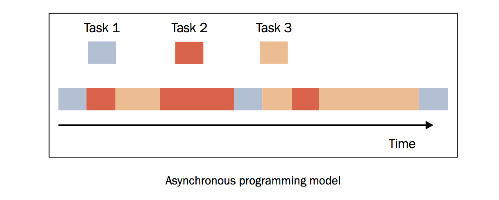

# Python asyncio异步IO(协程)

说到协程,就先说说有哪些并行方案,分别适用于哪些场景.

- 多线程  由于Python GIL解释器锁的问题,Python的线程无法发挥多核优势
- 多进程  进程之间资源不共享,通讯相对麻烦,但是还是可以通过管道来解决,或序列化对象.
- 多进程 + 多线程  即调用了CPU的多核特性,又有很好的异步效果
- 单线程 + 异步I/O  单线程实现的异步,像Redis就是采用的这种模式,既保证了数据的安全又有并行能力.

而不同的项目需求也决定了采用不同的方案,来实现项目.

其并发又分为**计算密集型**和**I/O密集型**:

- 计算密集型,如机器学习,图像图形处理,大量的科学计算,这样的项目中,对计算速度要求较高的,属于计算密集型,最好就使用进程来调用多核特性进行计算.
- I/O密集型,如并发请求和连接,这类不太耗费CPU资源,但是I/O并发量高的应用可以使用异步I/O来实现并发效果会更好,占用的资源更少.

网络模型有很多种，为了实现高并发也有很多方案，多线程，多进程。无论多线程和多进程，IO的调度更多取决于系统，而协程的方式，调度来自用户，用户可以在函数中yield一个状态。使用协程可以实现高效的并发任务。Python的在3.4中引入了协程的概念，可是这个还是以生成器对象为基础，3.5则确定了协程的语法。介绍asyncio的使用。实现协程的不仅仅是asyncio，tornado和gevent都实现了类似的功能。 

单进程中运行的为顺序执行,多线程和多进程为并行执行.除了顺序执行和并行执行的模型之外，还有第三种模型，叫做异步模型，这是事件驱动模型的基础。异步活动的执行模型可以只有一个单一的主控制流，能在单核心系统和多核心系统中运行。 

在并发执行的异步模型中，许多任务被穿插在同一时间线上，所有的任务都由一个控制流执行（单一线程）。任务的执行可能被暂停或恢复，中间的这段时间线程将会去执行其他任务。下面的这幅图可以清楚地表达这个概念。 

如上图所示，任务（不同的颜色表示不同的任务）可能被其他任务插入，但是都处在同一个线程下。这表明，当某一个任务执行的时候，其他的任务都暂停了。与多线程编程模型很大的一点不同是， *多线程由操作系统决定在时间线上什么时候挂起某个活动或恢复某个活动，而在异步并发模型中，程序员必须假设线程可能在任何时间被挂起和替换。* 

